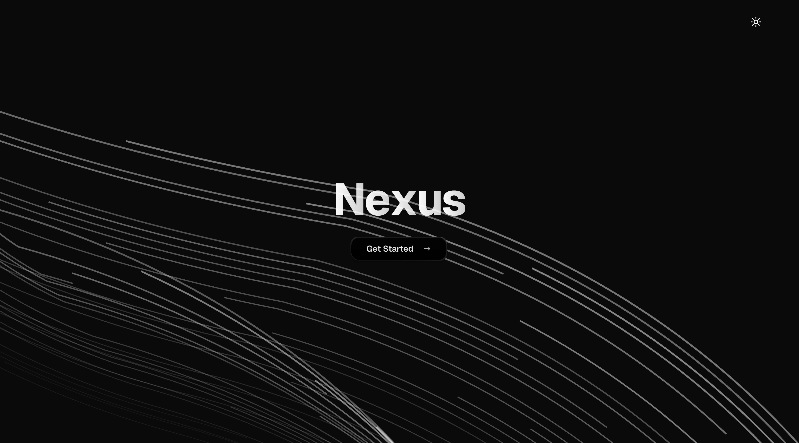

# Nexus

**Nexus** is a modern note-taking application that leverages AI to generate relevant thumbnails for each note, helping users visually organize their ideas. Designed with performance and simplicity in mind, it provides a focused writing experience with a clean interface and seamless user authentication.

---

## Tech Stack

### Framework & Libraries

- **Next.js** – Full-stack React framework for building scalable web applications.
- **Clerk** – User authentication and session management.
- **Motion** – Smooth transitions and animations throughout the UI.
- **ShadCN/UI** – Accessible, customizable components built with Tailwind CSS.

### Backend & Storage

- **Drizzle ORM** – Type-safe, SQL-first ORM for managing database operations.
- **Neon** – Serverless PostgreSQL database hosting with excellent DX.
- **Supabase** – Cloud storage solution for handling image uploads (e.g., AI-generated thumbnails).

---

